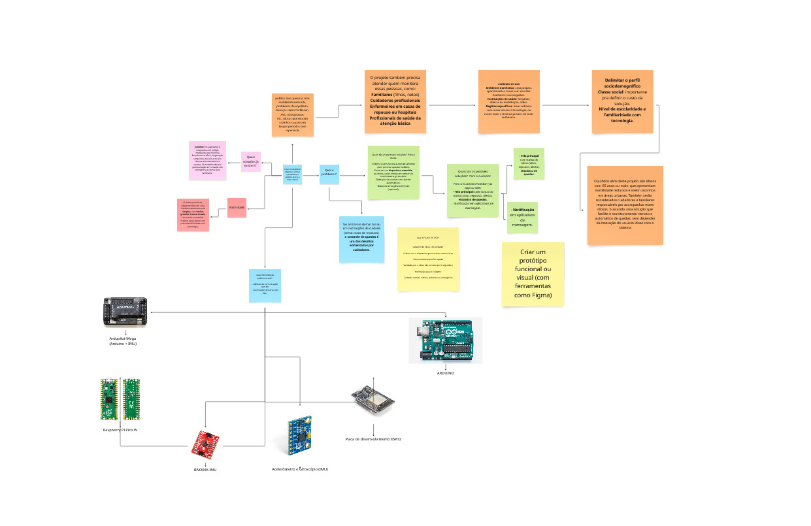

# Quarta-feira do Sprint: Decisão e Prototipagem

## Resumo

Na organização das atividades da quarta-feira, seguimos a metodologia proposta no livro *[Sprint](/Base/1.2.1.Lexicos.md#sprint)*, de Jake Knapp. Esse dia foi dedicado a **tomar decisões rápidas** sobre quais soluções seriam transformadas em protótipos e a **criar um storyboard** para ilustrar o fluxo do protótipo. A equipe passou por um processo estruturado de avaliação das ideias, utilizando técnicas como **críticas-relâmpago**, **votação** e **supervotos**, garantindo que as melhores ideias fossem escolhidas para a fase de prototipagem.

## Início do Sprint 

Como indicado no livro *Sprint*, de Jake Knapp, a quarta-feira é dedicada a **decidir rapidamente quais soluções serão prototipadas** e a **criar um storyboard** que mostre como a solução será apresentada ao usuário. Abaixo, mostramos as etapas que realizamos seguindo essa estrutura.

## Objetivo principal: 
Decidir quais soluções vão virar protótipos.

### Manhã:
  - **Análise crítica das soluções:** A equipe revisa as ideias geradas e decide quais têm mais chance de alcançar o objetivo de longo prazo.
  - **Método para decisões rápidas e eficientes:**
    1. **Museu de arte:** Expor as soluções na parede para observação silenciosa, sem interrupções.
    2. **Mapa de calor:** Cada membro coloca adesivos nas partes mais interessantes das soluções.
    3. **Críticas-relâmpago:** Discussão rápida sobre os destaques de cada solução, buscando identificar pontos fortes e fracos.
    4. **Votação:** Cada pessoa escolhe uma solução para votar com adesivo.
    5. **Supervoto:** O Definidor toma a decisão final, podendo usar "supervotos" para garantir a escolha.

- **Objetivo do processo:** Tornar a decisão mais ágil e eficiente, aproveitando as ideias da equipe sem sobrecarregar a memória de curto prazo e evitando discussões intermináveis.

---

### Estrutura do Processo de Decisão:
1. **Museu de arte:** Expor as soluções de forma visível e acessível.
2. **Mapa de calor:** Destacar as partes mais interessantes de cada solução com adesivos de bolinha.
3. **Críticas-relâmpago:** Discutir rapidamente os pontos fortes e registrar boas ideias.
4. **Pesquisa de intenção de voto:** Votação individual para priorizar as ideias.
5. **Supervoto:** O Definidor faz a escolha final usando supervotos, garantindo que a decisão seja tomada com base no consenso.

---

### Processo de Críticas-relâmpago:
  - O objetivo é identificar ideias que se destacam, sem que o criador do esboço influencie a opinião da equipe.
  - **Estrutura da discussão:**
    1. Reunir a equipe ao redor de um esboço.
    2. Cronometrar 3 minutos de discussão.
    3. O Facilitador narra o esboço e apresenta as ideias destacadas.
    4. A equipe sugere melhorias ou novas ideias.
    5. O Escrevente registra as boas ideias e preocupações.
    6. O criador do esboço fica em silêncio até o final.
    7. O criador explica as ideias não percebidas pela equipe e responde a perguntas.

---

### Pesquisa de Intenção de Voto:
  - **Objetivo:** Obter a opinião da equipe sobre quais ideias têm mais potencial.
  - **Etapas:**
    1. Cada membro recebe um adesivo para votar em uma ideia.
    2. A equipe reflete sobre o objetivo do sprint e as perguntas críticas.
    3. Cada pessoa escreve sua escolha em um post-it, podendo votar em um esboço ou em uma ideia específica.
    4. Explicação rápida de cada voto (1 minuto por pessoa).

  - **Objetivo do voto:** A votação não tem efeito definitivo, mas serve como uma orientação para o Definidor.

---

### Supervoto:
  - **Objetivo:** O Definidor toma a decisão final sobre as ideias vencedoras.
  - **Etapas:**
    1. O Definidor recebe 3 supervotos especiais.
    2. O Definidor escolhe as ideias mais promissoras com base nos votos ou pode escolher outras ideias por intuição.
    3. A decisão final é tomada, e os esboços com supervotos são escolhidos como base para o protótipo.

---

### Quando Há Conflitos entre Esboços:
  - Se mais de um esboço vencer, mas não puderem coexistir no mesmo protótipo, a equipe pode realizar uma "Batalha", testando ambos os protótipos separadamente.
  - Caso as ideias possam ser combinadas, um único protótipo será criado.

---

### Storyboard:
  - Após a decisão, a equipe cria um **storyboard** para ilustrar o fluxo do protótipo, garantindo que todos os elementos estejam alinhados.
  - **Passos para o Storyboard:**
    1. O storyboard é composto por 10 a 15 quadros que representam a jornada do usuário.
    2. Começa com uma cena de abertura, escolhendo um ponto de partida que ajude o público a reagir naturalmente.
    3. Os esboços vencedores são usados para preencher o storyboard.
    4. O foco é manter o storyboard simples, sem adicionar novas ideias ou soluções.
    5. O Definidor ajuda a garantir que o processo não se arraste e que o storyboard seja claro.

---

### Batalha ou Tudo em Um:
  - Se houver mais de um esboço vencedor, a equipe decide rapidamente se deve realizar uma **Batalha** para testar ambos os protótipos ou **combinar** as ideias em um único protótipo.
  - **Batalha:** Teste de protótipos distintos para comparar qual solução é mais eficaz.
  - **Tudo em Um:** Combinação das melhores partes de cada ideia em um único protótipo.

---

### Criando Marcas Falsas:
  - Quando dois protótipos são testados com os usuários, é importante criar **marcas falsas** para evitar confusão.
  - **Exemplo do Slack:** Um protótipo manteve o nome real, enquanto o outro recebeu o nome de "Gather".
  - **Outros exemplos:** Empresas como Blue Bottle Coffee usaram nomes falsos para testar diferentes ideias de lojas online.

---

### Anote-e-Vote:
  - Técnica para reunir ideias rapidamente e tomar decisões em grupo:
    1. Cada membro escreve suas ideias por 3 minutos.
    2. Todos escolhem as melhores ideias.
    3. As ideias principais são listadas no quadro branco.
    4. A equipe vota nas ideias favoritas.
    5. O Definidor toma a decisão final.

---

## SMA

No primeiro contato geral do grupo tivemos a primeira ideia de solução que seria desenvolver um sistema de monitoramento de qualidade da água. Foi discutido com o grupo em sua totalidade o impacto desse projeto, e como conclusão foi uma idéia superestimada, isso porque queríamos utilizar a indicador de Ph da água como a única forma de assegurar a qualidade da água.

Em mais deltalhes o projeto seria responsável de monitorar especificadamente a qualidade da água por meio do PH, utlizando sensores de aferição alocados dentro da Universidade de Brasília (UNB). O monitoramento e o mapeamento seria via interface mobile, que geraria relatórios periódicos sobre o nível de ph dos bebedouros. E caso tenha um indicador anormal, iria alertar automaticamente ao portador do aplicativo.

  <strong>ℹ️ O esboço dessa primeira ideia pode ser acessado em:</strong> 
  <a href="/#/Base/1.2.2.5W2H.md?id=sma">5W2H</a>

Dessa forma na primeira etapa **Museo da Arte** esta possível solução não atenderia aos requisitos do projetos a disciplina. Ainda assim continuamos a pesquisar mais afundo mas sem sucesso, prosseguimos com a próxima ideia.

---

## CuideMe

Esse projeto  veio como plano B, a equipe estava confiante na primeira decisão mas fomos devastados pela falta de embasamento que nele contia. Rápidamente juntou novamente o grupo e realizamos um brainstorm levantando nossas primeiras ideias que vinha sobre esse projeto.

O projeto CuideMe vem com a ideia de um aplicativo mobile voltado para a segurança de idosos, com foco na detecção automática de quedas através dos sensores do smartphone ou smartwatch, como acelerômetro e giroscópio. O app funciona de forma passiva, monitorando continuamente os movimentos do idoso durante o dia a dia. Em caso de uma possível queda, o sistema envia uma notificação perguntando se está tudo bem e, se não houver resposta dentro de alguns segundos, dispara um alerta automático com a localização exata para os contatos de emergência previamente cadastrados, como familiares ou cuidadores. 

Esse primeiro esboço pode ser visto a seguir:

Posteriormente levantando essas primeiras ideias, foi provocado aos integrantes a entender quais são os pontos mais interessantes desse projeto, e o resultado foi:

---

**1. Detecção Passiva e Inteligente**

**2. Integração com Sensores**

**3. Alerta com Geolocalização**

**5. Potencial de Expansão**

---

  <strong>ℹ️ Mais detalhes em:</strong> 
  <a href="/#/Base/1.2.2.5W2H.md?id=CuideMe">5W2H</a>

E foi provocado também as possíveis causas de fracasso, pela natureza do projeto alguns dos integrantes não se sentiam confortáveis com o mesmo por se tratar de ferramentas de tecnologias [embarcados](./1.2.1.Lexicos.md#embarcados)

  <strong>ℹ️ Mais detalhes em:</strong> 
  <a href="/#/Base/1.2.3.Ishikawa">Ishikawa</a>

## Conclusão de Decisão

A decisão pelo desenvolvimento do CuideMe foi resultado de um processo colaborativo e adaptativo, marcado pela resiliência da equipe diante de um revés inicial. Ao percebermos a falta de embasamento da nossa ideia anterior, reorganizamos rapidamente nosso foco e, com base em um brainstorm produtivo, identificamos uma nova proposta com forte relevância social e técnica. O CuideMe se destacou não apenas por sua aplicabilidade no cotidiano de idosos, mas também pelo seu potencial de impacto positivo e pela viabilidade tecnológica com os recursos que já existem nos dispositivos móveis. Embora alguns integrantes tenham demonstrado preocupação com o uso de tecnologias embarcadas, o projeto foi mantido como escolha por reunir um conjunto de funcionalidades inovadoras, como detecção passiva de quedas, geolocalização automática e possibilidade de expansão futura. Assim, a decisão final pelo CuideMe representa não apenas uma alternativa viável, mas uma solução com propósito, alinhada aos nossos valores de empatia, acessibilidade e inovação.

## Histórico de Versões

| Versão | Data       | Descrição                                                      | Autor(es)                                                   | Revisor(es)                        | Descrição da Revisão                                 |
|:------:|:----------:|:---------------------------------------------------------------:|:------------------------------------------------------------:|:----------------------------------:|:-----------------------------------------------------:|
| 1.0    | 10/04/2025 | Adição dos tópicos                                             | [Altino Arthur](https://github.com/arthurrochamoreira)       | [Lara Giuliana](https://github.com/gravelylara)     | Criação inicial do conteúdo                          |
| 1.1    | 10/04/2025 | Respostas aos tópicos referente à decisão                      | [Márcio Henrique](https://github.com/DeM4rcio)               | [Altino Arthur](https://github.com/arthurrochamoreira)                                   | Inclusão de respostas e complementos                 |
