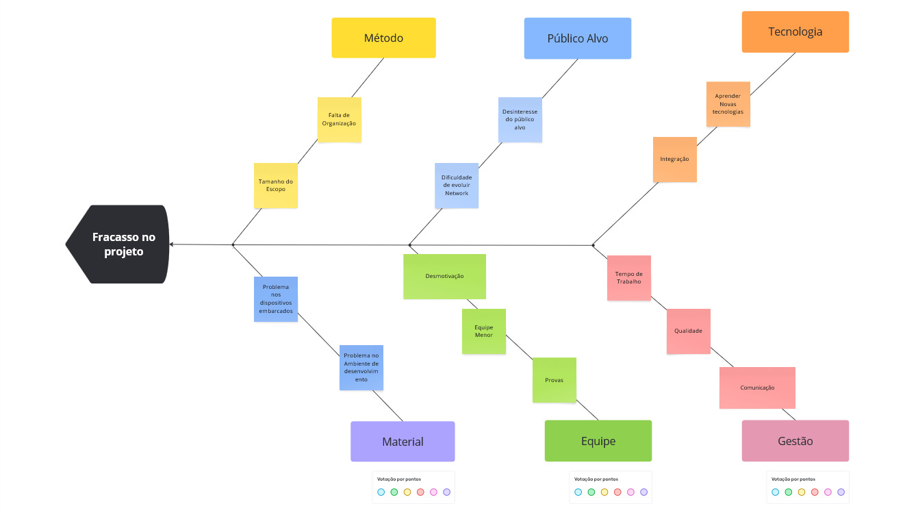

## Introdução

Este documento tem por objetivo explicitar os pontos de riscos para o desenvolvimento do tema de Controle de Queda de Idosos sugeridos pelo grupo 1 da disciplina de Arquitetura e Desenho de Software. Estes pontos serão apresentados por meio de Diagramas de Ishikawa - Diagrama Espinha de Peixe.

## Diagrama de Ishikawa
### Definição

No gerenciamento de projetos, assim como em qualquer área, existem problemas que podem ser solucionados definitivamente ao se conhecer as suas origens. Ou seja, para tratar o efeito é preciso entender as causas. Uma ferramenta bastante eficaz na solução de problemáticas de forma definitiva é o Diagrama de Ishikawa.

!!! info "Conceito de *Diagrama de Ishikawa*"
    Também conhecido como Diagrama de Causa e Efeito  ou Diagrama Espinha de Peixe,  o *diagrama Ishikawa* é uma ferramenta gráfica indicada para gerenciar e controlar a qualidade em diferentes processos dentro das empresas, possibilita investigar as verdadeiras causas dos problemas ou oportunidades de melhorias, mas vai além das causas principais e esmiúça também as causas secundárias.

## Metodologia

Para a elaboração dos Diagramas de Ishikawa foram utilizados os conhecimentos adquiridos na disciplina de Requisitos de Software da Universidade de Brasília, bem como os de Arquitetura e Desenho de Software.
Fora utilizada, também, a ferramenta [canva.com](https://www.canva.com) para a elaboração do modelo, a seguir, apresentado.

## Modelos

### Monitoramento de Idoso

## Histórico de revisão

| Versão | Data | Descrição | Autor(es)|Revisor(es)|
|:----:|:------:|:---------:|:--------:|:------:|
| 1.0  | 10/04/25 | Adição de introdução e Ishikawa | [Márcio Henrique](https://github.com/DeM4rcio),[Weslley](https://github.com/weslley17w), [Matheus](https://github.com/MatheusHenrickSantos), [Daniel](https://github.com/daniel-de-sousa)  ||
